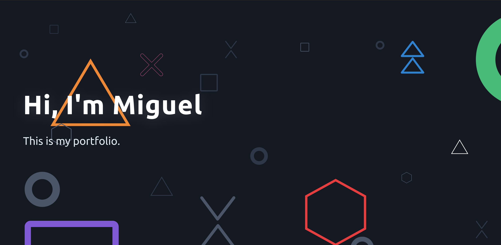

# Portfolio Gatsby

.
Acesso: https://elc1090.github.io/project1-emiliopedrollo/

#### Desenvolvedor(a)
Emilio B. Pedrollo

#### Cliente
Miguel M. Silva

#### Tecnologias

- Gatsby
- npm
- mdx

#### Ambiente de desenvolvimento

- Replit
- Node/NPM
- PHPStorm

#### Créditos

Preencha aqui uma lista detalhada de recursos aproveitados no projeto, por exemplo:
- Gatsby theme "cara"

#### Bastidores

A princípio estava planejando fazer o deploy no Replit, mas se mostrou bastante complicado para exibir uma página estática em uma subpasta sem estar executando algo para tornar isso possível. No final acabei usando uma action no Github para fazer o build da pasta `public` do gatsby e gerar uma page a partir disso. A parte mais complexa foi configurar o Gatsby para usar o prefixo `project1-emiliopedrollo` em todos os links, scripts e folhas de estilo da página.    

---
Projeto entregue para a disciplina de [Desenvolvimento de Software para a Web](http://github.com/andreainfufsm/elc1090-2023a) em 2023a
